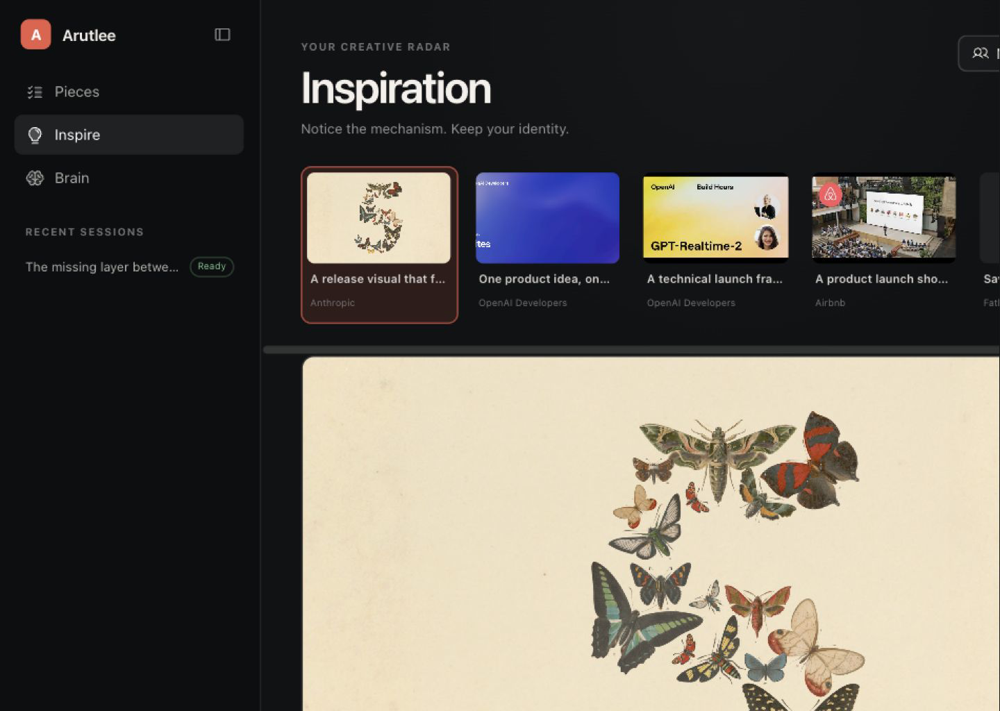
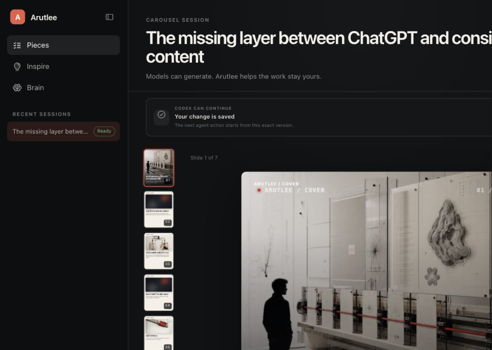
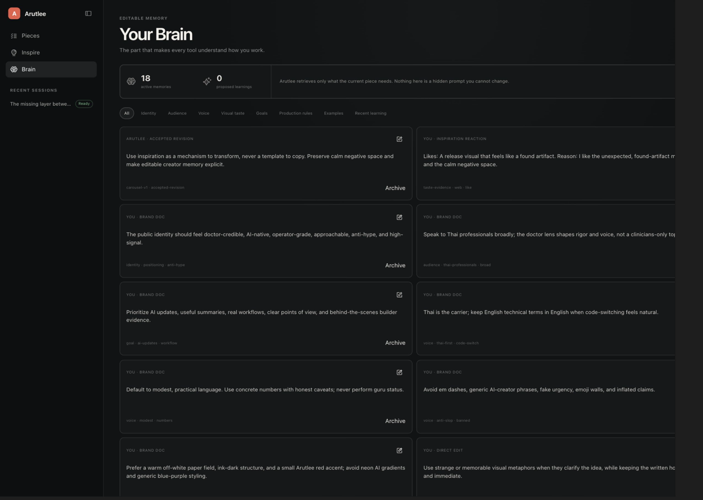

# Arutlee Studio UX/UI hackathon audit

Audited on 2026-08-31 against the live local product at its current seeded state.

## Executive verdict

Arutlee already looks credible, calm, and unusually finished for a hackathon product. The largest risk is not visual quality. It is that the winning idea is too easy to miss.

A judge can quickly recognize a polished carousel editor. They still have to discover the real differentiator: **editable creator memory + bring-your-own agent + a human-controlled collaboration trail**.

The next design pass should make three claims visible without explanation:

1. Arutlee knows what makes the creator's work theirs.
2. Codex or another agent can act through Arutlee with exactly that context.
3. The human can see, approve, edit, or undo every meaningful change.

The product should not add a large embedded chat. Codex or Claude remains the creator's cockpit; Arutlee is the shared, inspectable work surface.

## Audited flow

### 1. Inspiration — Healthy, but the conversion moment is understated

The image-first composition feels curated and premium. Source selection, reactions, creator tracking, and the path into a new piece are all present. The visual hierarchy strongly favors the reference image, while the most important product moment — turning a mechanism into an original, memory-informed piece — is mostly explained in the far-right detail panel.

**Strengths**

- Clear editorial taste; it does not feel like a generic social-content dashboard.
- Like/dislike and creator tracking make inspiration cumulative rather than disposable.
- Source lineage and a memory receipt support responsible borrowing.

**Risks**

- The first screen does not immediately prove what the agent learned or how the output will remain original.
- The action to create from a source is visually secondary to the source image.
- The horizontal source strip and creator-management action can disappear from attention on smaller widths.

### 2. Piece workspace — Visually strong, but the WebMCP advantage is hidden

The artifact-first canvas is the strongest surface in the product. The collaboration state, slide rail, output preview, source lineage, context receipt, activity trail, permissions, and undo history make this a real human-agent workspace. However, much of that evidence sits in a right inspector while the central canvas reads primarily as a carousel editor.

**Strengths**

- The output is large enough to feel like the work, not an attachment to a chat.
- Human ownership and the agent's scope are explicit.
- Versioned activity, review state, and undo create genuine collaboration safety.
- Source and memory provenance already exist in the product model.

**Risks**

- A judge can miss why WebMCP matters because the agent action and the resulting change are not tied together in the central canvas.
- `Ready` and `Finish slides` appear at the same time, which creates contradictory state semantics.
- `Codex can continue` is informative but gives no concrete next action or suggested request.
- The long piece title competes with the primary actions and compresses the working area.

### 3. Brain — Clear and editable, but it reads more like a database than a living advantage

The Brain is legible, editable, categorized, provenance-aware, and free of hidden prompts. That is strategically important. The current card grid explains what is stored but not the consequence of each memory.

**Strengths**

- Creator memory is visible and directly editable.
- Provenance differentiates brand documents, direct edits, inspiration reactions, and accepted revisions.
- Categories are understandable and the system explicitly promises bounded retrieval.

**Risks**

- Cards do not show where a memory was used or what it changed in an output.
- All cards have similar weight, so the most important identity and production rules do not stand out.
- `0 proposed learnings` gives no demonstration of the system growing with the creator.
- Archive is more visually prominent than the positive value of the memory.

## Highest-impact changes

| Priority | Change | Why it improves judging |
|---|---|---|
| P0 | Add a persistent proof lane on the piece: `Source → memories selected → Codex action → your decision` | Makes the WebMCP and memory value understandable in under 10 seconds. |
| P0 | Make agent changes a visible review moment: changed-slide marker, before/after copy or visual diff, and `Keep`, `Edit`, `Undo` | Creates the memorable human-agent collaboration moment the demo currently lacks. |
| P0 | Add a seeded 60–90 second judge demo with one clear starting action | Removes setup and scrolling risk; guarantees the full value loop can be shown live. |
| P1 | Make Brain consequences visible: `used in this piece`, last used, source, and the exact decision it influenced | Proves memory is operational, not a settings page or long prompt. |
| P1 | Clarify states and actions: `Draft → Needs review → Ready → Live`; show only the action appropriate to the state | Removes the `Ready` / `Finish slides` contradiction and makes human control obvious. |
| P1 | Tighten navigation around the mental model: `Studio`, `Inspire`, `Brain` | Makes the central place for creating clearer than the generic label `Pieces`. |
| P2 | Increase microcopy contrast and touch targets; reduce title height; strengthen selected and agent-changed slide states | Improves legibility, polish, and presentation reliability without changing the visual character. |

## Recommended proof lane

The proof lane should be part of the working surface, not a marketing explanation:

1. **Source mechanism** — “Unexpected found-artifact reveal”
2. **Brain used** — three small, inspectable memory chips
3. **Agent action** — “Codex revised slides 3 and 6 through WebMCP”
4. **Your decision** — “Review 2 changes”

Opening any item should reveal the exact evidence. This preserves the quiet OpenAI-like aesthetic while making the product's intelligence visible.

## Recommended winning demo

1. Open one inspiration and react to it.
2. Create a piece; show the source mechanism and three selected memories.
3. Ask Codex to revise one slide from the creator's normal Codex workspace.
4. Return to Arutlee and reveal the highlighted change plus before/after evidence.
5. Keep or edit it, then show the accepted learning in Brain.

The judge should be able to summarize the product immediately afterward:

> Arutlee is the editable memory and collaboration layer that lets any agent create consistent, on-brand content while the human stays in control.

## Accessibility and resilience risks

- The global focus-visible outline is a good baseline.
- Several normal-text combinations are below the 4.5:1 contrast target: collaboration microcopy is about 3.74:1, sidebar microcopy about 3.16:1, and Brain tags about 2.94:1.
- Icon buttons are 30×30 px and the primary button minimum is 38 px; important controls should approach a 44×44 px target.
- Some meaningful states rely heavily on coral/green color. Pair them consistently with labels or icons.
- The right inspector collapses below the main content at narrower widths; the proof lane should keep the essential collaboration evidence near the artifact rather than depending on that inspector.

## Evidence limits

- This was a focused live audit of the seeded Inspiration, Piece, and Brain states.
- The screenshots show the main visual surface; the browser screenshot compositor omitted part of the far-right area in the wide state, so right-panel findings were verified through the live semantic interface as well.
- This was not a full keyboard, screen-reader, mobile-device, or user-research study.

## Build order

Do the three P0 changes before adding more formats, dashboards, decoration, or onboarding. The current aesthetic is already strong enough. Winning is now about making the unique mechanism impossible to miss.
